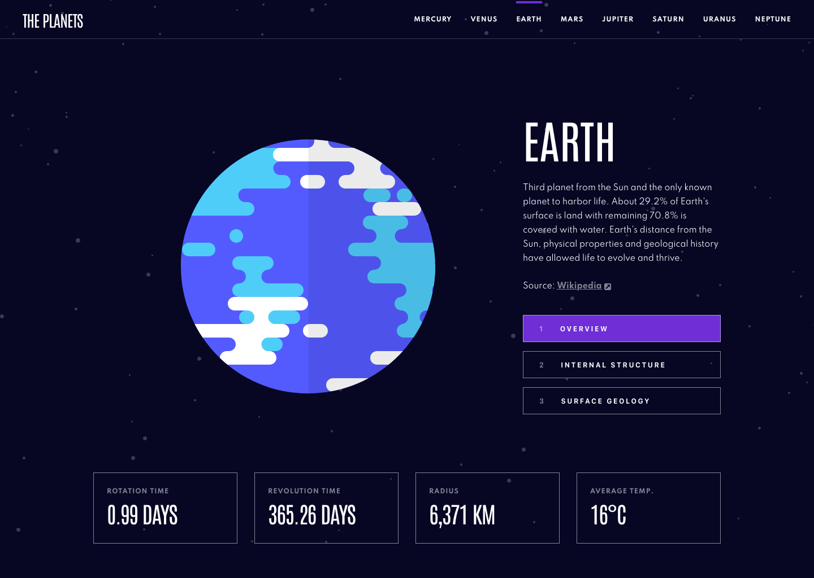

# Frontend Mentor - Planets fact site solution

This is a solution to the [Planets fact site challenge on Frontend Mentor](https://www.frontendmentor.io/challenges/planets-fact-site-gazqN8w_f). Frontend Mentor challenges help you improve your coding skills by building realistic projects.

## Table of contents

- [Overview](#overview)
  - [The challenge](#the-challenge)
  - [Screenshot](#screenshot)
- [My process](#my-process)
  - [Built with](#built-with)
  - [What I learned](#what-i-learned)
  - [Continued development](#continued-development)
- [Author](#author)

## Overview

### The challenge

Users should be able to:

- View the optimal layout for the app depending on their device's screen size
- See hover states for all interactive elements on the page
- View each planet page and toggle between "Overview", "Internal Structure", and "Surface Geology"

### Screenshot

### Links

- Solution URL: [Add solution URL here](https://your-solution-url.com)
- Live Site URL: [Add live site URL here](https://your-live-site-url.com)

## My process

### Built with

This is my first time working using HTML SASS/CSS & JS to build a site from scratch, I come from a background of using visual editors on wordpress, I've decided to take myself to the next level and have been studying for the last 3 weeks.

My code is very very ugly IMO, I wouldnt be using it as an example if you're going for best practices.

- HTML5 markup
- SASS
- Flexbox
- Mobile-first workflow
- Vanilla JS

### What I learned

I learned ... I have alot to learn, but this is a start!

I really need to get a firm hold of JS, I have repeated myself WAY TOO much and quite frankly am embarrsed by it .. however, I guess we all got to start somewhere right?

First time using fetch to call JSON data, I got stuck on this for a good 2-3 hours, in the end I found a roundabout way to use the data from the JSON file, more study and practice needed.

Perhaps this all would of been much easier if I was using a framework like react, I plan to learn this once I have a better understanding of Vanilla JS.

### Continued development

Learn grid
Dealing with data from JSON
Rendering entire site with JS, doing this may have saved me alot of headaches?
Need to add CSS Page transitions
JS,JS,JS and the React/Next

## Author

Jean-Marc

- Frontend Mentor - [@jahkoora](https://www.frontendmentor.io/profile/jahkoora)
